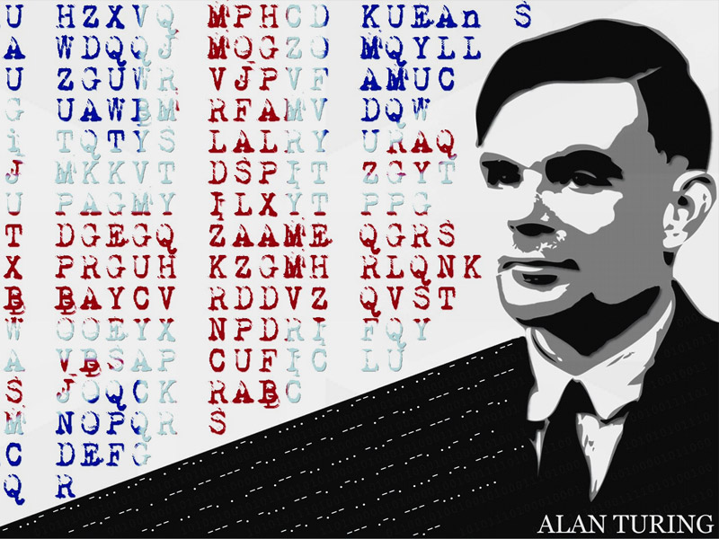

# RSA Encryption


This repository contains the implementation of RSA encryption, created as an evaluation form in the Discrete Mathematics discipline <br>
taught by Professor Dr. Bruno Pimentel, at the Federal University of Alagoas.<br>

<br>
Do you want to know more about Alan Turing? [Here](https://super.abril.com.br/historia/alan-turing/) has an article about his history.
<br>
Envolved students in this project:<br><br>

- Carllos Eduardo Ferreira Lopes<br>
- João Vitor Santos Tavares<br>
- Welson Deivid dos Santos<br>

## What is encryption?

Cryptography is a set of principles and techniques used to encrypt writing, making it unintelligible for those who do not have access to combined conventions or combined keys.
<br>
The Encryption method showed here is one above many encryptation method's.
and is called RSA encryption method.
<br>
The name of this method is an acronym of the surname of its creators:<br>

- Ron Rivest<br>
- Adi Shamir<br>
- Leonard Adleman

#### How does it work?<br>

RSA was built on one of the most classic areas of mathematics, number theory. It is based on the difficulty in factoring a number into its prime components. First let's remember that a prime number is a number that can only be divided by itself and by 1 (in an exact division, without broken numbers); second, we have to remember how to find the prime factors of a number.


<br>

Alan Turing's Cipher Competition Divulgation Image

### A little of history

Cryptography was important for the victory of the Allies in World War II. During the Second World War, the Germans had a cipher machine called an enigma, which generated encrypted codes every day, and had thousands of possible combinations, testing 1 to 1 every day and still taking into account that every day the combinations change is humanly impossible, but thanks to Alan Turing, and his machine, the cipher of the puzzle was broken and the Allies won victory in the war.
<br>
<br>

Benedict Cumberbatch as Alan Turing in Imitation's Game, Alan Turing Biography Movie.<br>

## Time for action!


We will show you here an implementation of the python RSA encryption algorithm and explain the math behind it.<br>

#### Operation

As already mentioned, RSA consists of generating numbers that are too large to be factored.
<br>

- First we generate two different prime numbers: P and Q.
- After that, we generate a number N, which will be the result of the product of P and Q.
- Now we calculate Euler's totient function, Phi (N), which will be the product of our two prime factors, defined as (P - 1) (Q - 1).
- Now we calculate E, which will be a prime number to that generated by Phi (N).<Br>

#### Time to encrypt!

- First we generate the public key, using our prime factors P and Q.
- Then we generate our N from the product of P and Q.
- We calculate Phi (N) and use it to find our E.

Now that we have the public key, let's use it to encrypt our message!
<br>
Our message will be encrypted using the following formula:
```
C = Encrypt(m) = m ^ E mod N
```
Where:
- m is the character to be encrypted.
- E is our coprime number.
- N is our product of P and Q.
- C is the encrypted character.<Br>

##### Our Python functions for encrypting:

Public key generation:
```python
print("Insert two prime numbers P and Q:")
    while True:
        p = int(input())#User have to insert an P prime number
        q = int(input())#User have to insert an Q prime number
        if is_prime(p) and is_prime(q):#This while is only breaked when the both numbers are primes
            break
    n = p * q
    totient = phi_function(p, q)
    while True:
        print("Insert a value E / mcd(E, Phi) = 1")
        e = int(input())#User have to insert an E number that are coprime to Totient
        if are_coprimes(totient, e, 1, 1, 1) and e < totient:#E have to be coprime to the totient
            break
    p_key = n, e
```
<br>Encryptation:
```python
def encrypt(text, E, n):
    lenght = len(text)
    text = text.lower()#Converting message to lower case, so we don't need other 2 dictionaries
    binary = bin(E).replace("0b", "")
    binn = list(binary)
    binn.reverse()
    bin_list = []
    i = 0
    for c in binn:
        if c == "1":
            bin_list.append(pow(2, i))
            i += 1
        elif c == "0":
            i += 1
    i = 0
    encrypted = ""
    while i < lenght:
        if not text.isdigit():
            letter = text[i]  # Only one letter at time
            aux = catalougue[letter]
            index = fast_exponenciation(bin_list, n, 1, aux % n, 1)#Conversion and concating in string
            encrypted = encrypted + str(index)
            if i + 1 != lenght:
                encrypted += " "
        i += 1
    return encrypted
```
<br>
As we are dealing with very large numbers, we use a fast modular exponentiation method using binaries, functions:

```python
def fast_exponenciation(bin_list, n, i, y, z):
    if i > int(bin_list[-1]):
        return z % n
    else:
        if i in bin_list:
            z = z * y
            #print(z)
        return fast_exponenciation(bin_list, n, i * 2, (y * y) % n, z)

def con_bin(num):
    if num == 1:
        return "1"
    else:
        r = str(num % 2)
        return r + con_bin(num // 2)
```
<br>
Our encrypted message will be saved to a file.

#### Time to decrypt!

- First, we request the prime numbers P and Q.
- Now we use again P and Q to calculate our N.
- We use our prime numbers to calculate the totient, Phi (N).
- With our E and Phi (N), we now calculate our d, which will be our modular inverse of E.
<br>
<br>

Now that everything is ready, let's decrypt our message!
<br>

To decrypt the message, we use the formula:
```
m = Decrypt(C) = C ^ d mod N
```
<br>
Where:<br>

- C is the character to be decrypted in number format.
- d is the inverse of e calculated as:
```
E * d mod Phi(N) = 1
```
<br>
- N is the product of our prime numbers.
- m is the decrypted character.<br>

##### Our python functions for decrypting:


Modular inverse function, using the extended euclidean algorithm:
```python
def Extended_Euclidean_Algorithm(a, b):
    if a == 0:
        return b, 0, 1
    else:
        g, y, x = Extended_Euclidean_Algorithm(b % a, a)
        return g, x - (b // a) * y, y

def inverse(a, m):
    g, x, y = Extended_Euclidean_Algorithm(a, m)
    if g != 1:
        raise Exception('modular inverse does not exist')
    else:
        return x % m
```

<br>Decrypt function:
```python
def decrypt(Encrypted, n, d):
    lenght = len(Encrypted)
    decrypted = ""
    binary = bin(d).replace("0b","")
    binn = list(binary)
    binn.reverse()
    bin_list = []
    i = 0
    for c in binn:
        if c == "1":
            bin_list.append(pow(2, i))
            i += 1
        elif c == "0":
            i += 1
    i = 0
    print(bin_list)
    #print("AUGUSTINHO CARRARA")
    while i < lenght:
        aux = ""
        while i < lenght and Encrypted[i] != ' ':#Verifying if the next position of message is a ','
            aux += Encrypted[i]
            i += 1
        i += 1
        #print(aux)
        aux = int(aux)
        index = fast_exponenciation(bin_list, n, 1, aux % n, 1)
        decrypted += catalougue2[index]
    return decrypted
```
<br>
And again, as we are dealing with very large numbers, we use the fast modular exponentiation function with binaries.<br><br>


<br>

Isso é tudo, pessoal!<br>

If you want to see the program up and running, you can access the program's repository link [Here](https://github.com/JT4v4res/RSA-Encryption). :)
